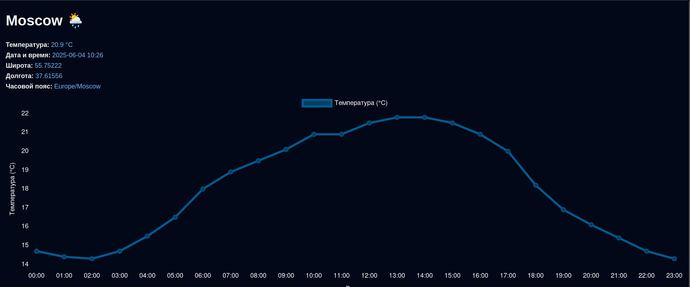

## Weather Forecast Service
   Сервис предоставляет прогноз погоды по городу на 24 часа с графиком температуры по часам. 
   Использует API (https://open-meteo.com) и кэширует данные в памяти.

#### Сборка и запуск:
1. Клонируйте репозиторий: git clone https://github.com/FrostmourneHungers4YourSoul/doczilla-test.git
2. Перейдите в папку: cd ~/doczilla-test/weather-forecast-service
3. Соберите и запустите проект: mvn compile exec:java -Dexec.mainClass="ru.doczilla.WeatherApp"
4. HTTP-запрос с браузера: GET localhost:8080/weather?city={city}

#### Используемые API:
    Геокодинг:
        https://geocoding-api.open-meteo.com/v1/search?name={city}
    Погода:
        https://api.open-meteo.com/v1/forecast?latitude={lat}&longitude={lon}&hourly=temperature_2m

#### Пример графика:
   

#### Стек: 
      - Java 17
      - Maven
      - Jackson
